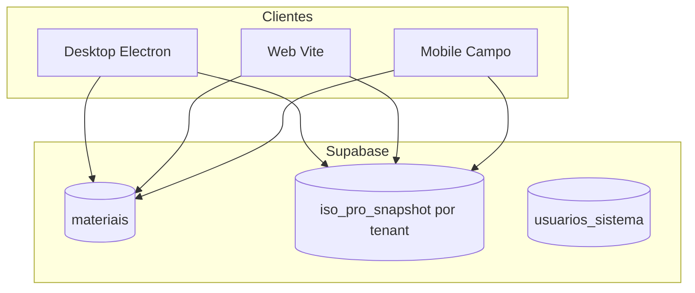

# Roadmap multi-tenant e operação — I.S.O PRO

Documento de referência para evolução do **desktop**, **web** e **mobile (Campo)** após incidentes de importação (materiais/planejamento) e segunda empresa no mesmo Supabase.

Última revisão: 2026-05.

---

## O que já foi corrigido (produção)

| Área | Correção |
|------|----------|
| Materiais | PK `(tenant_id, id)`; código único por empresa |
| Materiais | Removido índice global `materiais_codigo_lower_idx` |
| Materiais | Paginação Supabase >1000 linhas |
| Snapshot | Purge nuvem zera `atendimentos`, `etiquetas` |
| Purge | Delete de materiais/dispositivos filtrado por `tenant_id` |
| Planejamento | Scripts SQL para histórico órfão + testes de integridade |
| localStorage | Chaves operacionais com sufixo `::tenant:<uuid>` (empresa ≠ default) |

Scripts úteis: `supabase/snippets/auditar_multi_tenant_iso_pro.sql`

---

## Prioridade 1 — Curto prazo (PC / Web)

### 1.1 localStorage por empresa ✅ (implementado)

- Chaves via `getScopedIsoProStorageKey()` incluem `::tenant:<uuid>` quando a empresa activa não é a default.
- Empresa principal (tenant default) mantém chaves **legadas** (sem sufixo) — compatibilidade com instalações existentes.
- `setActiveTenantId()` invalida cache do snapshot ao trocar empresa.

### 1.2 Import planejamento — UX quando bloqueia

- [ ] Opção explícita: *“Substituir planejamento e limpar histórico incompatible”* (com confirmação dupla).
- [ ] Mensagem com passos: limpar cadastros, SQL auditoria, ou contactar admin.

### 1.3 Falhas silenciosas na nuvem

- [ ] Em modo nuvem, **não** fazer `.catch(() => readAll())` em `loadDocumentos()` / import materiais.
- [ ] Mostrar erro: “Não foi possível ler a nuvem; verifique ligação.”

### 1.4 Mensagens de erro amigáveis (PT)

- [ ] Mapear `duplicate key`, `materiais_pkey`, `materiais_tenant_id_codigo_lower_uidx`, `Gravacao bloqueada…` para texto operacional.

### 1.5 Testes

- [x] Integridade histórico órfão (`snapshotDocumentosPlanejamentoIntegrity.test.ts`)
- [x] Import JSON bloqueado por integridade (`documentos.service.import-integrity.test.ts`)
- [ ] Import CSV planejamento com Supabase mock (551 linhas)
- [ ] Troca tenant + localStorage isolado
- [ ] Conflito snapshot no import

---

## Prioridade 2 — Médio prazo

### 2.1 Segurança Supabase (Web + Mobile + Desktop)

- [ ] Supabase Auth + JWT com claim `tenant_id`
- [ ] RLS em todas as tabelas com `tenant_id` (hoje o isolamento é sobretudo na aplicação + chave anon)
- [ ] Rever snippets: `rls_auth_jwt_tenant_exemplo.sql`, `custom_access_token_hook_iso_pro.sql`

### 2.2 Mobile (app Campo)

- [ ] `(tenant_id, device_id)` único — mesmo telemóvel em duas empresas
- [ ] Alinhar formato de `atendimentoHistorico` ao desktop (`documentoId`, `documentoItemId`)
- [ ] Mesma estratégia de conflito de snapshot (`baselineUpdatedAt` / retry)
- [ ] Testes de contrato em `packages/iso-pro-shared` quando qualquer app altera o payload

### 2.3 Web (build Vite)

- [ ] Documentar na UI: import grande (800+ linhas) preferir **instalador Windows**
- [ ] Expandir E2E Playwright: login multi-empresa, import pequeno
- [ ] Monitorizar tamanho do payload snapshot (alerta se > limite)

### 2.4 Operação

- [ ] Botão “Auditar snapshot” na administração (wrap do SQL de auditoria)
- [ ] Checklist pós-import: materiais → planejamento → amostra de desenhos
- [ ] Teste de restauro trimestral (runbook §1)

---

## Prioridade 3 — Longo prazo

- [ ] Snapshot menos monolítico (listas muito grandes em tabelas ou blobs paginados)
- [ ] Sequência de IDs materiais com lock/retry (race em imports paralelos)
- [ ] 2FA para administradores na web
- [ ] Sentry: alertas por taxa de erro e versão de build

---

## Arquitectura (referência)

**Contrato partilhado:** `packages/iso-pro-shared` (Zod + tipos do snapshot).

**Isolamento por empresa:** `tenant_id` em queries + linha `(id='default', tenant_id)` no snapshot + sufixo `::tenant:` no localStorage (empresas não-default).

---

## O que não mudar sem decisão explícita

- Afrouxar integridade planejamento ↔ atendimento **sem** confirmação do utilizador.
- Separar bases Supabase por cliente (multi-tenant actual é adequado após correcções).
- Unicidade global de `device_id` mobile se empreiteiros usam a mesma empresa Supabase para várias obras.

---

## Referências no repositório

| Tema | Ficheiro |
|------|----------|
| Chaves localStorage | `src/lib/isoProAmbiente.ts` |
| Tenant activo | `src/lib/isoProTenant.ts` |
| Integridade planejamento | `src/lib/snapshotDocumentosPlanejamentoIntegrity.ts` |
| Import documentos | `src/modules/documentos/services/documentos.service.ts` |
| Import materiais | `src/modules/materiais/services/materiais.service.ts` |
| Purge nuvem | `supabase/functions/purge_cloud_cadastros/` |
| Auditoria SQL | `supabase/snippets/auditar_multi_tenant_iso_pro.sql` |
| Runbook operação | `docs/runbook-operacao.md` |
